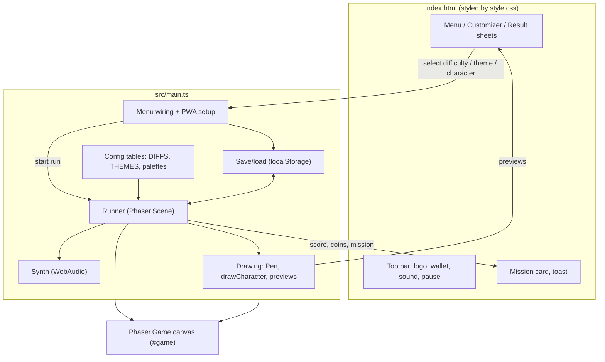
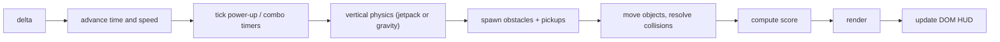
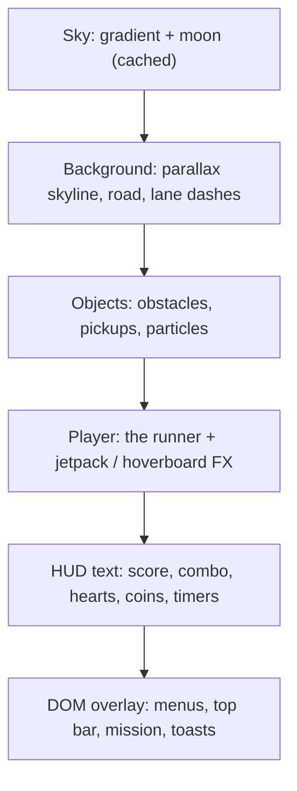
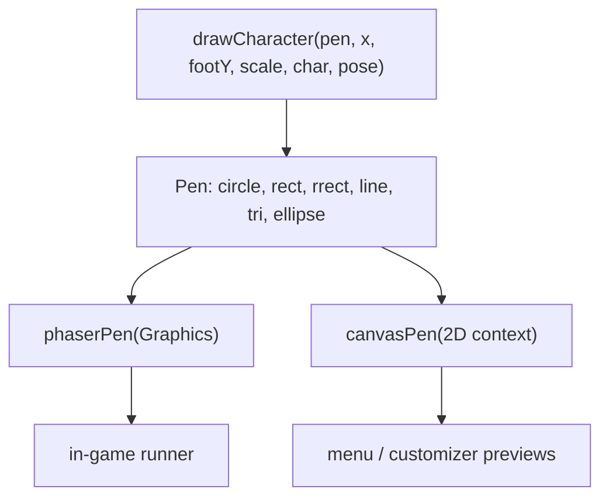
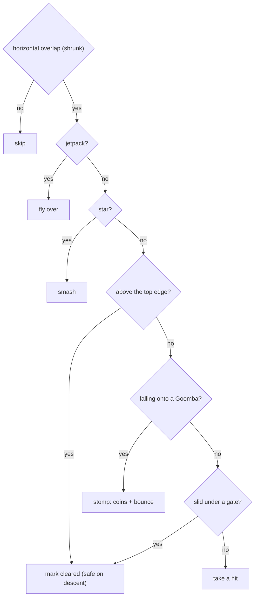
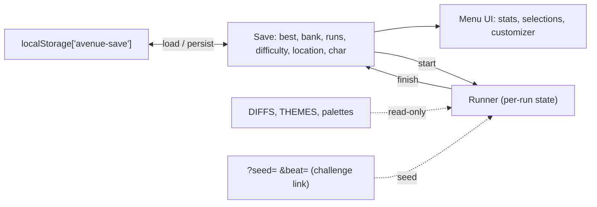
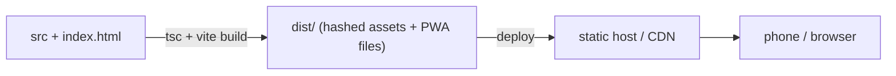

# System Architecture

Avenue Run is a browser game built with Phaser 3, TypeScript and Vite. It runs
entirely on the client: no server, no database, no image assets. This document
explains how the pieces fit together.

## Overview

The game is a 2D side-scroller. A single Phaser scene owns everything and runs
the same sequence of steps on every frame: read input, update physics, spawn
obstacles, resolve collisions, update the score, then draw. The DOM handles the
menus and HUD chrome; the canvas handles the world.

The canvas (Phaser) draws the world and the in-game HUD text. The DOM overlay
(menus, top bar, mission card, toasts) sits above it with a higher `z-index`.
The menu talks to the game by calling `Runner.start()` and by writing to the
shared `save` object; the game talks back by updating DOM elements.

## Project layout

| Path | Purpose |
| --- | --- |
| `index.html` | DOM shell: menus, top bar, mission card, toast |
| `src/main.ts` | All game logic |
| `src/style.css` | Styles for the DOM overlay |
| `public/` | PWA manifest, service worker, icon |
| `vercel.json` | Build and serve config for hosting |

`main.ts` is a single file. The game is small enough that keeping the loop in one
place is easier to follow than spreading it across modules. Inside, it is grouped
into sections: type definitions, configuration tables, save/load, the audio
synth, the `Runner` scene, the drawing helpers, and the boot and menu wiring.

## Runtime model

Phaser drives the loop by calling `Runner.update(delta)` once per frame. The
steps run in a fixed order:

Two details worth noting:

- The frame delta is clamped, so a hitch can't move an object far enough to skip
  a collision.
- Spawns are scheduled against an elapsed-time clock and driven by a seeded PRNG
  (`mulberry32`). The same seed reproduces the same run, which is what makes the
  daily and challenge links deterministic.

## Rendering

Depth is faked with parallax instead of a real camera. Four canvas layers are
drawn back to front each frame; the sky only redraws when the theme or window
size changes.

Everything is vector drawing. Buildings, obstacles, coins, power-up badges,
particles and the runner are all shapes emitted each frame; there are no sprites
to load. Parallax comes from scrolling each band at a different fraction of the
travelled distance.

### The Pen abstraction

The runner has to be drawn in two places: inside the game (a Phaser `Graphics`
object) and in the menu previews (separate HTML canvas 2D contexts). To avoid
writing that code twice, drawing goes through a small `Pen` interface with a
handful of primitives. Two implementations back it: one wraps Phaser `Graphics`,
the other wraps a 2D context.

`drawCharacter()` takes a character description (gender, skin tone, hair style and
color, outfit) and a pose (run cycle, airborne, sliding, landing, jetpack), and
emits pen calls. Because both surfaces share the code, the customizer preview
always matches the runner you play.

## Physics and collision

Vertical movement is written by hand rather than using Phaser's physics engine.
That keeps it in step with the custom renderer and gives precise control over
feel.

Jumping uses three common techniques: coyote time (a short grace period after
leaving the ground), input buffering (a tap just before landing still counts),
and asymmetric gravity (rising is floatier than falling). Double jump and a slide
complete the moveset. When a jetpack is active, gravity is replaced by a climb to
a hover height.

Collisions use axis-aligned boxes with generous margins, so a graze never feels
unfair.

A run starts with three hearts. A hit costs one heart and grants a brief window
of invincibility; a hoverboard absorbs one hit; a star or jetpack ignores hits
entirely; only the last heart ends the run. The per-obstacle `cleared` flag is
the important detail: once the runner is above an obstacle's top edge, it is
marked cleared and cannot kill you on the way back down.

## Game systems

| System | Notes |
| --- | --- |
| Spawning | Obstacle rows pick goomba/gate/cone/barrier weighted by difficulty; pickups roll coins against power-ups. A short warm-up delays the first obstacle. |
| Power-ups | Each is a countdown on the scene (jetpack, hoverboard, star, magnet, sneakers, invincibility). The mushroom adds a heart. Effects are read where they apply. |
| Particles | A flat array with simple integration and fade, reused for landing dust, pickup bursts, jetpack flames and ambient specks. |
| Combos / score | Passing or stomping obstacles and grabbing coins refresh a combo timer; score is distance plus coins. |
| Audio | The synth builds tones from WebAudio oscillators, started on first input to satisfy autoplay rules. |
| Themes | Choosing a location swaps the active palette and skyline (sky, buildings, road, accent, plus palm / elevated-train flags). |

## State and persistence

State is small and flat. Configuration tables are read-only; the only persisted
value is the save.

`loadSave()` validates every field (indices clamped, numbers bounded), so old or
corrupt storage can't crash a run. A run reads the selected difficulty, theme and
character at start, and writes back the best score, coin bank and run count when
it ends. Challenge links carry a seed (the course) and a target score in the URL;
nothing is stored server-side.

## Build and hosting

Vite type-checks and bundles to `dist/` with content-hashed filenames. A
manifest and service worker make it installable and playable offline. Because the
game is client-only, any static host works; `vercel.json` builds with
`npm run build` and serves the static output.
