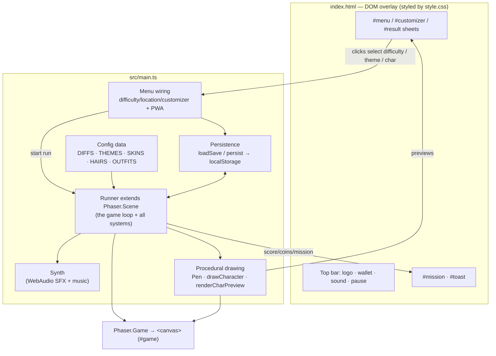
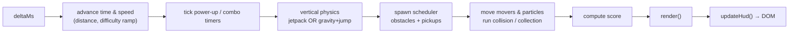
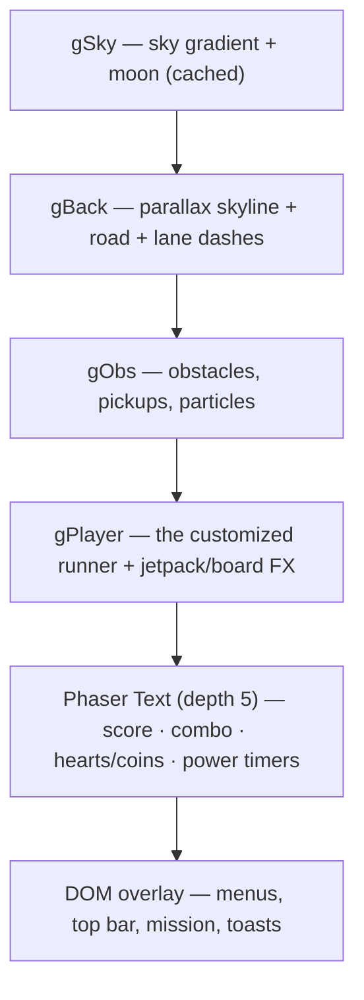
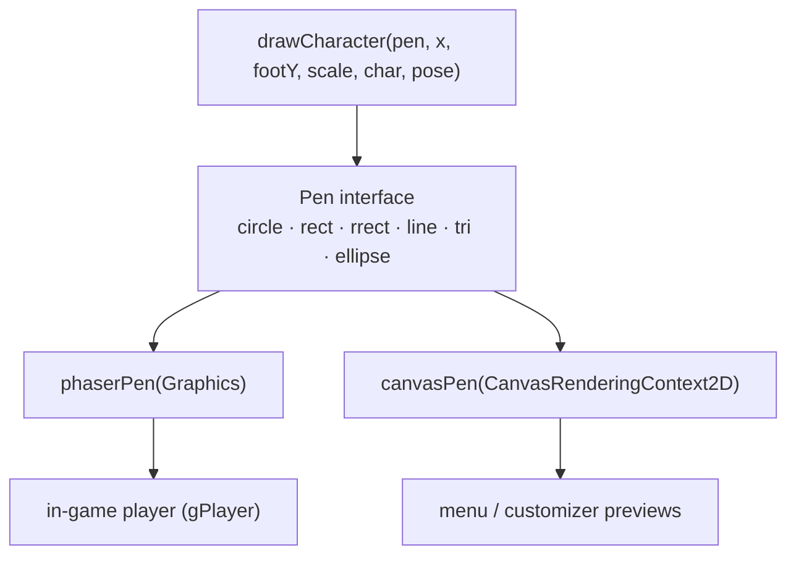
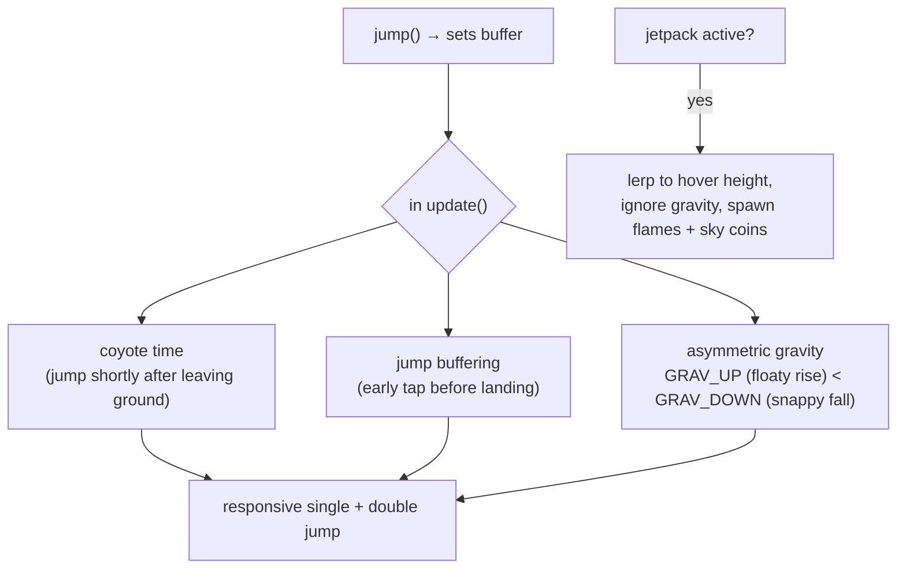
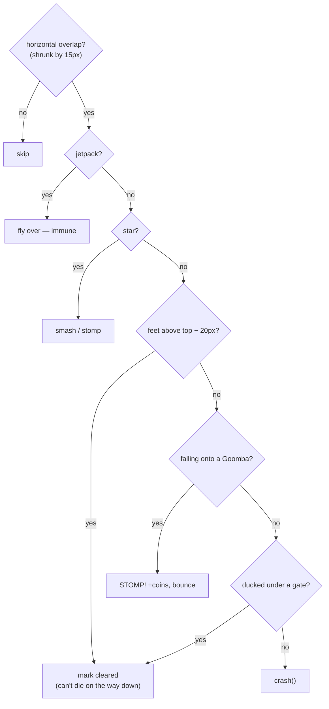
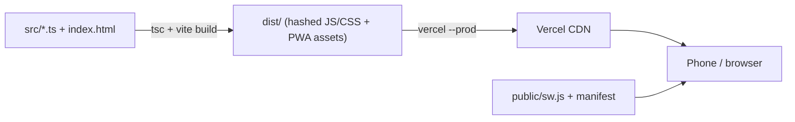

# 🏗️ Avenue Run — Architecture

This document describes how Avenue Run is put together: the runtime layers, the
game loop, the rendering pipeline, the physics/collision model, and the data
flow between the menu, the game scene, and persistent storage.

> **TL;DR** — A single [Phaser 3](https://phaser.io/) `Scene` runs a fixed set of
> systems every frame (input → physics → spawn → collision → score → render).
> All art is drawn **procedurally** (no image assets) through a small `Pen`
> abstraction so the *same* character-drawing code renders both the in-game
> player (Phaser `Graphics`) and the menu previews (HTML `Canvas2D`). Config
> lives in plain data tables (`DIFFS`, `THEMES`, customization palettes); a tiny
> `Save` object in `localStorage` is the only persistent state.

---

## 1. High-level structure

The whole game is one Vite + TypeScript app. `index.html` provides the DOM
shell (menus, HUD chrome), `src/main.ts` contains all game logic, and
`src/style.css` styles the DOM overlay.



**Two rendering surfaces, one screen.** The `<canvas>` (Phaser) draws the world
and the in-game HUD text; the DOM overlay (menus, top bar, toasts, mission card)
sits on top with a higher `z-index`. Menus talk to the game by calling
`Runner.start()` and by mutating the shared `save` object; the game talks back by
updating DOM elements (score bank, mission bar, toasts).

---

## 2. Module map (`src/main.ts`)

| Section | Responsibility |
| --- | --- |
| **Types** | `Kind`, `Mover`, `Char`, `Save`, `Part`, `Diff`, `Theme`, `Pose`, `Pen` |
| **Config tables** | `DIFFS[]` (speed/accel/spawn), `THEMES[]` (palette/skyline), `SKINS`/`HAIR_COLORS`/`OUTFITS`/`HAIRS` |
| **Persistence** | `loadSave()` / `persist()` — validates + reads/writes `localStorage["avenue-save"]` |
| **`Synth`** | WebAudio background loop + one-shot SFX (jump, coin, stomp, power-up…) |
| **`Runner`** | The `Phaser.Scene`: state, game loop, physics, spawning, collision, power-ups, particles, rendering |
| **Drawing** | `Pen` interface + `phaserPen`/`canvasPen`, `drawCharacter`/`drawHair`, `renderCharPreview` |
| **Boot + wiring** | `new Phaser.Game(...)`, menu/difficulty/location/customizer event handlers, PWA install + service worker |

It is deliberately a **single file** — small enough to keep the whole loop in
view, with clear sections instead of cross-file indirection.

---

## 3. The game loop

Phaser calls `Runner.update(_, deltaMs)` once per animation frame. The loop is a
fixed pipeline; each stage reads/writes scene state and the last stage renders.



Key properties:

- **Delta-clamped** (`min(deltaMs, 42)`) so a stall can't tunnel the player
  through obstacles.
- **Deterministic spawning** via a seeded PRNG (`mulberry32(seed)`), so a given
  seed reproduces the same run (used for shareable challenge links).
- **Time-based scheduling**: `nextObstacle` / `nextPickup` are timestamps on the
  `elapsed` clock, not frame counters.

---

## 4. Rendering pipeline

The world is a **2.5D side-scroller**: a ground line at `y = h·0.8`, the player
fixed near the left, and everything else moving left. Depth is faked with
parallax layers and a fixed player camera.

Four Phaser `Graphics` layers are drawn back-to-front every frame (except the
sky, which only redraws on theme/resize):



- **Parallax**: a far building band scrolls at `distance·0.18`, the near band at
  `distance·0.4`, palms/elevated-train and road dashes at their own rates — cheap
  depth without a camera.
- **Everything is procedural**: buildings, obstacles, coins, power-up badges,
  particles and the character are all vector shapes drawn each frame. No sprites,
  no atlas, no texture loading.

### The `Pen` abstraction (one character, two surfaces)

Character art must appear **in the game** (Phaser `Graphics`) *and* **in the menu
previews** (independent HTML `<canvas>` 2D contexts). Rather than duplicate the
drawing, a minimal `Pen` interface abstracts the primitives:



`drawCharacter()` reads a `Char` (gender, skin, hair, hair color, outfit) and a
`Pose` (run swing, airborne, sliding, landing squash, jetpack) and emits pen
calls. Swap the pen implementation and the identical figure renders to either
surface — the customizer preview is guaranteed to match the in-game runner.

---

## 5. Physics & collision

Vertical motion is a small hand-rolled model (not Phaser Arcade physics), which
keeps it fully in sync with the procedural renderer.

### Jump feel



### Collision — forgiving AABB

Obstacles and pickups are `Mover`s that scroll left. Each frame, colliding
movers are resolved with generous grace so a graze never feels cheap:



`crash()` implements survivability: **3 hearts**, a hit costs one heart + ~1.6 s
invincibility, a hoverboard absorbs one hit, a star/jetpack/invincibility window
ignores hits, and only the final heart ends the run. The per-mover `cleared`
flag is the key detail — once you're over something you "run over" it instead of
dying as you descend.

---

## 6. Systems reference

| System | How it works |
| --- | --- |
| **Spawning** | Time-scheduled from the seeded PRNG. Obstacle rows pick `goomba / gate / cone / barrier` weighted by difficulty; a warm-up delays the first obstacle so you ease in. Pickups roll coins vs. power-ups. |
| **Power-ups** | Each is a timer on the scene (`jet`, `board`, `star`, `magnet`, `sneaker`, `invuln`) decremented each frame; effects are read in physics/collision/HUD. `mushroom` adds a heart. |
| **Particles** | A flat `Part[]` pool: landing dust, coin/pickup bursts, jetpack flames, ambient neon specks. Simple Euler integration + fade; drawn via the same `Pen`. |
| **Combos & score** | Passing/stomping obstacles and grabbing coins refresh a combo timer; `score = distance-based + coins·bonus`. |
| **Audio** | `Synth` builds tones with WebAudio oscillators (no audio files); started on first interaction to satisfy autoplay policies. |
| **Themes** | Selecting a location swaps the active `Theme` (sky gradient, building palette, road/accent colors, palms/elevated-train flags). |

---

## 7. Data & persistence

State is intentionally tiny and flat. Config tables are read-only; the only
mutable persistent value is the `Save`.

```mermaid
flowchart LR
  LS["localStorage['avenue-save']"] <-->|loadSave / persist| SAVE["Save { best, bank, runs, difficulty, location, char }"]
  SAVE --> MENU["Menu UI (stats, selected pills, customizer)"]
  SAVE -->|start()| RUN["Runner (per-run state)"]
  RUN -->|finish()| SAVE
  CFG["DIFFS[] · THEMES[] · palettes"] -. read-only .-> RUN
  URL["?seed=&amp;beat= (challenge link)"] -.-> RUN
```

- `loadSave()` defensively validates every field (indices clamped, numbers
  bounded) so corrupt/old storage can't crash a run.
- A run reads `curDiff` / `curTheme` / `save.char` at `start()`; on `finish()` it
  writes back `best`, `bank` (coins) and `runs`.
- Challenge links carry a `seed` (deterministic course) and `beat` (target
  score) in the URL — no backend required.

---

## 8. Build & deployment



- **Vite** type-checks and bundles to `dist/`; asset filenames are content-hashed
  for cache-busting.
- **PWA**: `manifest.webmanifest` + a service worker enable install-to-home-screen
  and offline play. `vercel.json` builds with `npm run build` and serves `dist/`.
- **Stateless hosting**: everything runs client-side, so any static host works;
  production lives on Vercel at [avenue-run.vercel.app](https://avenue-run.vercel.app).

---

## 9. Why these choices

- **Single scene, single file** — the game is small; one readable pipeline beats
  scattered systems and indirection.
- **Procedural art + `Pen`** — no asset pipeline, tiny download, infinitely
  recolorable characters, and one source of truth for the runner across game and
  UI.
- **Hand-rolled vertical physics** — precise control over game feel (coyote time,
  buffering, asymmetric gravity, forgiving hitboxes) that a generic physics body
  makes awkward.
- **Data-driven difficulty/themes** — new difficulties or locations are new rows
  in a table, not new code paths.
- **Client-only + seeded RNG** — zero backend, yet daily/challenge runs are
  reproducible and shareable via a URL.
