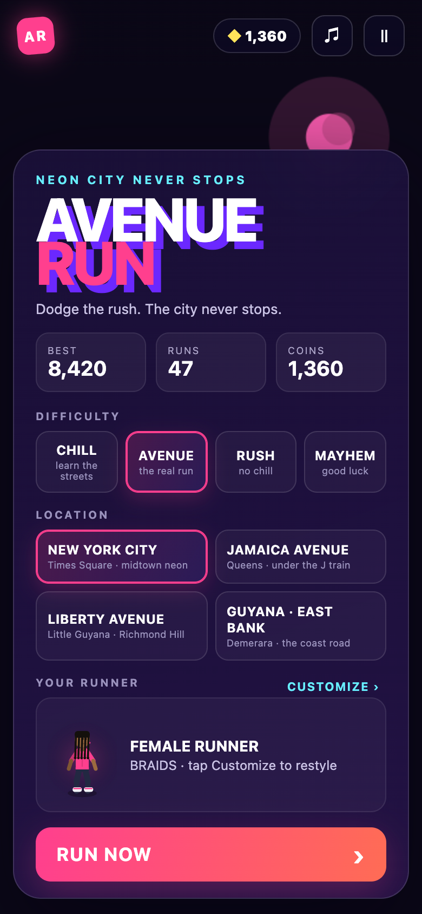
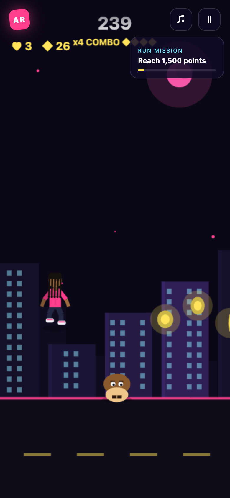
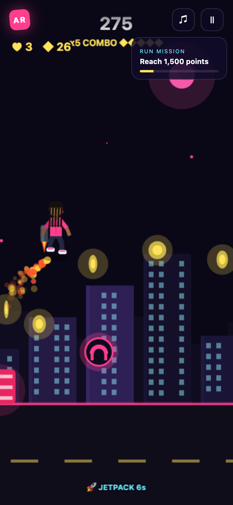
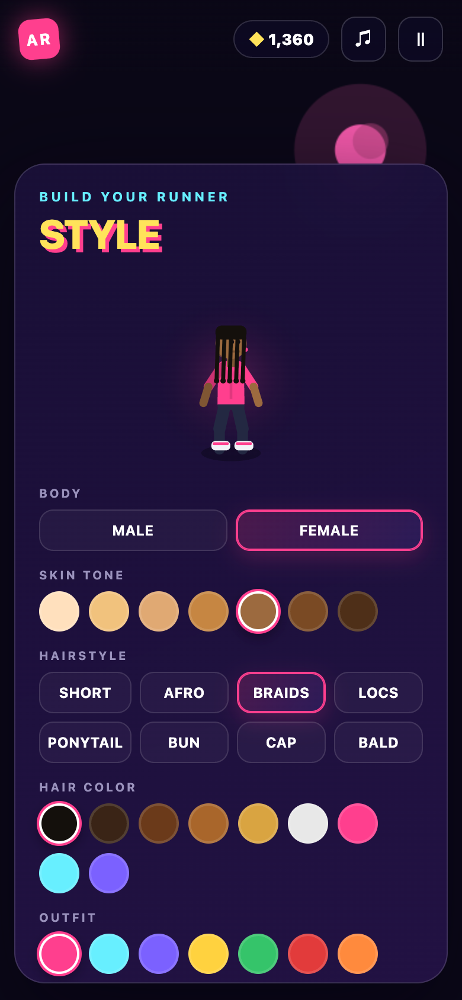

# 🏙️ Avenue Run

A fast, neon **side‑scrolling endless runner** — a Mario × Subway‑Surfers mashup you can play right in your browser or install to your phone. Dodge the rush, stomp the Goombas, grab coins, ride power‑ups, and rack up combos down four real avenues.

### ▶️ Play now: **[avenue-run.vercel.app](https://avenue-run.vercel.app)**

_Works on any phone — just open the link and tap **RUN NOW**. Tap **Add to Home Screen** to install it as a full‑screen app._

---

## 📸 Screenshots

| Menu | Gameplay |
| :--: | :--: |
|  |  |
| **Jetpack** | **Character Customizer** |
|  |  |

---

## ✨ Features

- **4 difficulties** — `CHILL`, `AVENUE`, `RUSH`, `MAYHEM` — each with its own speed, acceleration and obstacle density.
- **4 locations**, each with its own skyline, palette and vibe:
  - 🗽 **New York City** — Times Square / midtown neon
  - 🚆 **Jamaica Avenue** — Queens, under the elevated J train
  - 🪔 **Liberty Avenue** — Little Guyana, Richmond Hill (palms + string lights)
  - 🌴 **Guyana · East Bank** — Demerara, the coast road
- **Full character customizer** — male/female body, **7 skin tones**, **8 hairstyles** (short, afro, braids, locs, ponytail, bun, cap, bald), **9 hair colors** and **8 outfits**.
- **3 hearts + forgiving hitboxes** — a graze won't instantly end your run; a hit costs a heart with brief invincibility.
- **Combos, missions, coins** and a persistent best score / coin bank (saved locally).
- **Installable PWA** with offline support and share‑a‑challenge links.

## 🎮 Controls

| Action | Touch | Keyboard |
| --- | --- | --- |
| Jump / double‑jump | **Tap** | `Space` / `↑` / `W` |
| Slide | **Swipe down** | `↓` / `S` |
| Pause | — | `P` |

## 🚀 Power‑ups

| | Power‑up | Effect |
| :--: | --- | --- |
| 🚀 | **Jetpack** | Blast into the sky and fly over everything through a trail of coins |
| 🛹 | **Hoverboard** | Rides under your feet and absorbs one hit |
| ⭐ | **Super Star** | Invincible — smash straight through obstacles |
| 🍄 | **1‑UP Mushroom** | Extra heart |
| 🧲 | **Magnet** | Pulls in nearby coins |
| 👟 | **Super Sneakers** | Higher jumps |

Enemies: **stomp Goombas** by landing on them for bonus coins, jump barriers/cones, and **slide under** the brick gates.

## 🛠️ Tech

- [Phaser 3](https://phaser.io/) game engine · TypeScript · [Vite](https://vitejs.dev/)
- All art is drawn procedurally at runtime (no image assets) — the character is rendered from your customization every frame.
- Deployed on [Vercel](https://vercel.com/) as an installable PWA.

## 🏗️ Architecture

Curious how it's built? **[ARCHITECTURE.md](ARCHITECTURE.md)** documents the game
loop, the layered procedural rendering pipeline, the `Pen` abstraction that draws
the character to both the game canvas and the menu previews, the forgiving
collision model, and the data/persistence flow — with diagrams.

## 💻 Local development

```bash
npm install
npm run dev      # start the dev server (http://localhost:5173)
npm run build    # type-check + production build to dist/
npm run preview  # preview the production build
```

## 🌐 Deploy

Push to Vercel (or import the repo):

```bash
npx vercel --prod
```

The included `vercel.json` builds with `npm run build` and serves `dist/`.

---

Built with ☕ and neon. Chase the combo. Own the avenue.
